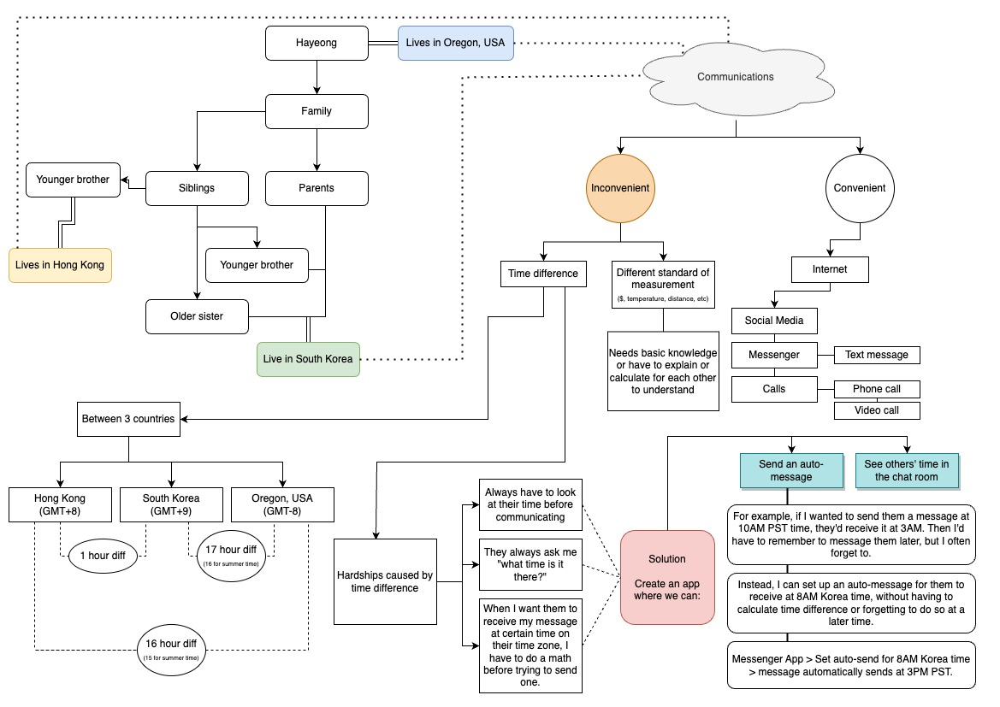
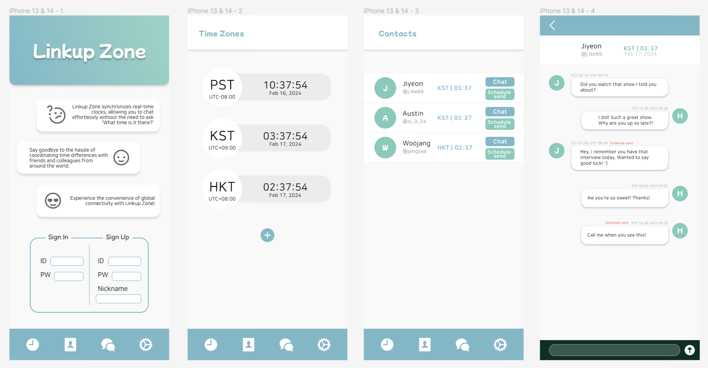

# Capstone Research and Planning
by [Hayeong Pyeon](https://www.hayeong.website)

## Description
- This is a brainstorming section for Capstone project. 
- Draw.io was used for **Idea Board & Outline**. 
- **Application Planning #1** includes more in-depth plans about the app design and functionality, and what technologies to be used for major features. Came up with a name for this app - **Linkup Zone**. 
- **Application Planning #2: Capstone Project Proposal** follows a template provided by Epicodus. This proposal is included as a beginning part of MVP building. 
- Any in-person discussion regarding the project will be uploaded separately from the README, in `.txt` format, for recording and future reference purpose. 

## Idea Board

- This program is initially built for me and my family members who live in different countries with different time zones. 
- When this program is ready, we can communicate with each other without having to calculate their current, past, or future times in different time zones when trying to reach out to each other. 
- This program will also have an auto-send system that will have a message sent at a specific time of the receiver. For example, if I want a person residing in Korea to receive this message at 8AM their time, I can set their time for the receiving time then it'll automatically send the message at 3PM PST, without me having to calculate the time difference. 
- End goal for this program is to successfully apply software knowledge learned in Epicodus and to learn how to use Swift, the iOS app development tool. 
- Possible roadblocks: I have not developed an app that involves real-time messaging system or account set-up for users. 
- If I were asked to begin working on this program now, I would start with coming up with dashboard design on Figma and see what can be done with HTML, CSS, JavaScript and webpack. 

## Application Planning #1

- The application has 4 different menu sections: Time Zones, Contacts, Chat, and Settings. Time Zones and Chat sections will be priotized. 
- Technologies to be used: 
1. This project will be React-based. 
2. Messaging interfaces including displaying messages, input fields for typing messages, buttons, and other clock features will be built by creating components. 
3. `useState` and Redux will be used to keep track of the messages sent and received in each chat room. 
4. JavaScript's `Date` object will be used for current timestamp for sender's and receiver's time zones. 
5. Messages displayed will have information including sender's username, message content, and the timestamp. 
6. If time zone conversion is needed, `date-fns` will be used. 
7. In order to display real-time messages (without requiring users to refresh the page), **Firebase**, or other database technology will be used. 
8. **Jest** will be used to test out accuracy of messaging features including message contents and timestamps. 
- Presentation (project objective): [discussion](/Discussion.txt) conducted with a peer about the application planning. 

## Application Planning #2: Capstone Project Proposal

### Project's Purpose or Goal
> What will it do for users?    
> List the absolute minimum features the project requires to meet this purpose or goal.     

Users should be able to do the following:
- create accounts, log in and out, and terminate their accounts. 
- select their time zone upon signing up and change it when needed through account management.  
- choose other time zones to view and have it added to their time zone list. 
- add contacts (either by phone number, email address, or user name) to their contact list. 
- view other users' time zones in the contact list. 
- send each other messages that are displayed with time information: their time zone and the user's time zone when sent/received. 

### Resources to be used for the MVP
> What tools, frameworks, libraries, APIs, modules and/or other resources (whatever is specific to your track, and your language) will you use to create this MVP?     
> List them all here. Be specific.
- Frontend Framework: React
- Styling: SCSS, Bootstrap, Flexbox, Grid, etc. 
- State Management: To manage user sessions, contacts, and messaging, planning to utilize React's built-in state management using useState and useEffect hooks initially. 
- Authentication: For user authentication (email/password, Google sign-in, etc), planning to use Firebase Authentication. 
- Database: To store user data, contacts, and messages, planning to use Firebase Realtime Database integrated with React. 
- Timezone Handling: Plannng to use libraries like moment-timezone or date-fns in JavaScript to handle conversions and display timestamps correctly based on the user's timezone.
- Testing: Planning to use Jest along with React Testing Library.
- Deployment: Netlify for frontend hosting. 

### Possible Further Enhancement
> If you finish developing the minimum viable product (MVP) with time to spare, what will you work on next? Be specific.

Users will be able to explore more in this chat, for example:
- advanced security features. 
- check the real-time currency exchange rate between the currency of the user in the chat with you and the currency in the country you're in.
- view converted measurement standards (i.e. lbs to kg, mile to km, inches to cm, etc) upon receiving messages containing this information. 
- block users in order to hide their own profiles to the blocked users and to not receive messages from them. 
- send pictures / GIFs in the chat. 
- view chat history by dates. 

> What additional tools, frameworks, libraries, APIs, or other resources will these additional features require?
- Advanced Security Features:
  - Encryption libraries like CryptoJS for encrypting messages.
  - OAuth2 for secure authentication and authorization.
  - HTTPS for secure communication between client and server.

- Real-time Currency Exchange:
  - Currency exchange rate API such as Open Exchange Rates, CurrencyLayer, or Fixer.io.
  - JavaScript libraries like Axios or Fetch for making API requests.

- Measurement Unit Conversion:
  - convert-units for JavaScript.

- User Blocking:
  - Additional database fields to store block lists for each user.
  - Server-side logic to handle blocked users and filter out messages.

- Sending Pictures/GIFs:
  - Firebase Storage for storing and serving images/GIFs.
  - React-dropzone for handling file uploads.

- View Chat History by Dates:
  - Database design for storing chat messages with timestamps.
  - Server-side logic to query and retrieve chat history based on selected dates.
  - Pagination logic for handling large chat histories.

- More...
  - WebSocket integration for real-time communication for enhanced user experience.
  - A library like moment.js for more sophisticated date and time manipulation.

### Research & Planning 
> This research plan is constructed ahead of the listed dates and is being updated after each day to log what has been completed with total hour information to show how many hours are spent. On May 6th, everything below will be the final log of research and planning conducted. Required total is 120 hours including development. 

**Friday, January 12th**
- [Idea Board](#idea-board)
> total: 4 hours

**Friday, February 16th**
- [Application Planning #1](#application-planning-1)
> total: 4 hours 

**Thursday, April 4th**
- [Proposal building](#application-planning-2-capstone-project-proposal)
- Youtube tutorials on creating messaging apps
- Research on Firebase, what it offers and what developers use it for
> total: 6 hours

**Friday, April 5th**
- How to test using React Testing Library
- Research on moment-timezone library and how date-fns in JS are generally used

## License
Copyright © 2024 Hayeong Pyeon | [MIT](/LICENSE.txt) 